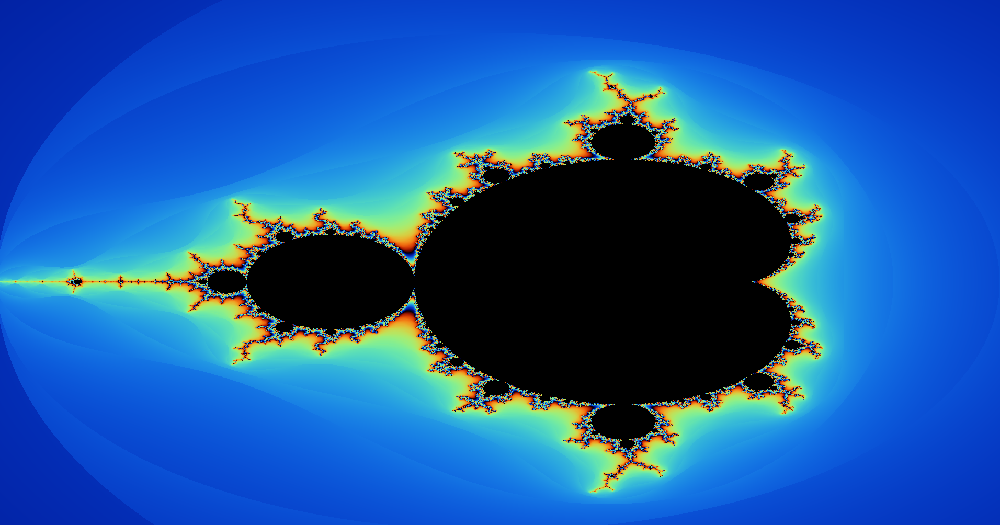

# Mandelbrot Renderer in C

Real-time Mandelbrot set explorer written in C with SDL2, built on my own small complex-number and matrix library (`matrix.c`).



**Features**
- Escape-time algorithm with **smooth iteration count**, for a continuous coloring without banding
- Polynomial color palette; points inside the set are drawn in black
- 1920×1080 rendering, 500 max iterations
- **Interactive zoom:** left click zooms ×10 on the clicked point, right click zooms out

**How zooming works:** the clicked pixel is mapped back to the complex plane with the same linear mapping used for rendering. The view is re-centered on that point and its width and height are scaled by the zoom factor, then the frame is re-rendered.

Serial (single-threaded) version.

## Build & run

Requires SDL2 (`sudo apt install libsdl2-dev` on Debian/Ubuntu).

```
make
./mandelbrot
```
